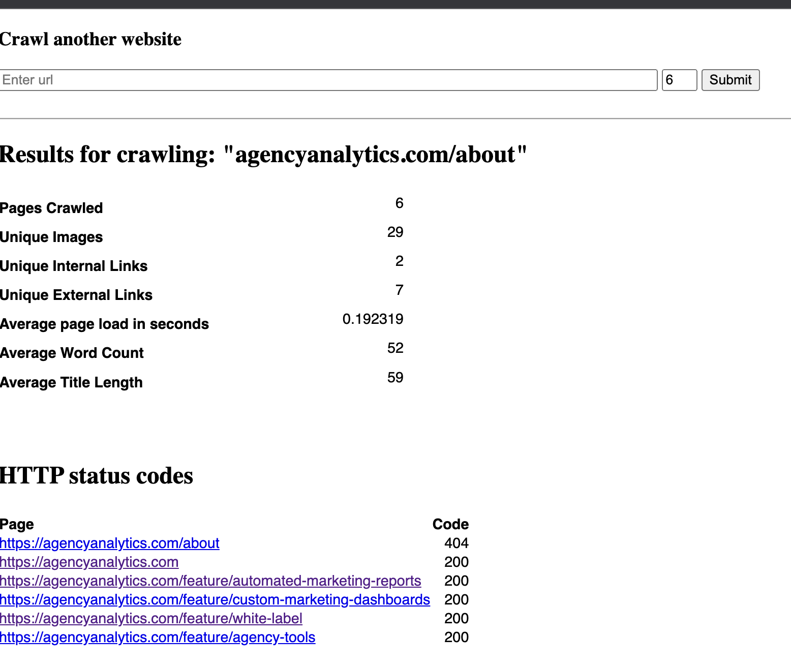

## Web Crawler backend challenge

### Description

Using PHP, build a web crawler to display information about a given website.
Crawl 4-6 pages of our website agencyanalytics.com given a single entry point. Once
the crawl is complete, display the following results:
Number of pages crawled
Number of a unique images
Number of unique internal links
Number of unique external links
Average page load in seconds
Average word count
Average title length
Also display a table that shows each page you crawled and the HTTP status code
Deploy to a server that can be accessed over the internet. You can use any host of
your choosing such as AWS, Google Cloud, Heroku, Azure etc. Be sure to include the
url in your submission.
Requirements

The app is built with PHP
The crawler is built for this challenge and not from a library
The app is properly deployed to a hosting service
Code is hosted in a public repository, like Github.com
Bonus: Use of PHP 7 or 8 and its features
Bonus: Use of a framework such as Laravel or Phalcon

What we're looking for

1. High quality and polished code
2. Attention to architecture and organization
3. Accuracy of the crawled information

## How the code is organized
1) A route is created in the web routes file. This loads up the welcome view along with the relevant data
```text
GET /crawl
```

2) An instance of the WebCrawlerUtil is loaded up in the service container and can be used anywhere in the application. The instance is used in the HomeController to get the relevant data to feed the view with. For simplicity and based on the requirment of this task, "https://agencyanalytics.com/" is crawled by default the first time the page loads.
3) The view further provides a form input that accepts a url. The url is sent via POST request to the same route, the relevant data is returned to the view.

### Example

## Tests
To run the tests
```text
php artisan test
```
